<div align="center">

# 🎞 Путешествие по миру советских мультфильмов

**Интерактивная командная игра для урока литературы в 4 классе**

Учитель выводит игру на проектор, класс делится на 3–4 команды, и за 35 минут ребята отвечают на вопросы о мультфильмах и книгах, по которым они сняты.

### [▶ Открыть игру в браузере](https://fegke12.github.io/multfilm-quiz/)


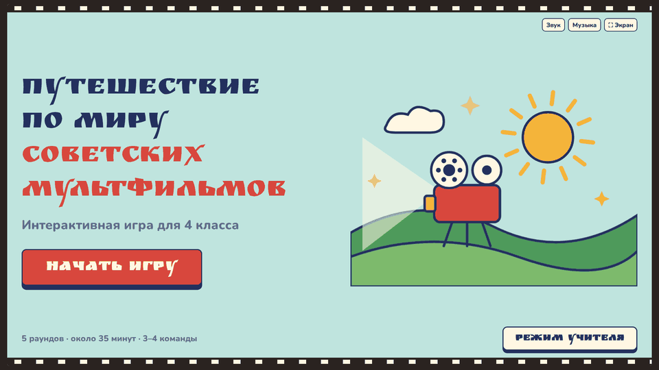

</div>

---

## Что это

Это не набор слайдов, а настоящая игра. Кнопки работают, варианты ответов нажимаются, баллы считаются сами, а учитель в любой момент может всё поправить вручную.

- **5 раундов, 25 заданий.** Вопросы идут от простых к сложным.
- **Связь с литературой.** В каждом раунде есть писатели и книги, а целый раунд посвящён тому, по каким произведениям сняты мультфильмы.
- **Счёт для 3–4 команд.** Названия команды придумывают сами, баллы видны на экране всё время.
- **Режим учителя.** В нём видны правильные ответы, можно менять баллы, пропускать вопросы и досрочно завершить игру.
- **Работает без интернета и установки.** Это один файл `index.html`, который открывается в любом браузере.

## Как проходит урок

| Этап | Что происходит | Время |
|---|---|---|
| Вступление | Обложка, правила, названия команд | 2–3 мин |
| Раунд 1 «Угадай мультфильм» | 6 вопросов с вариантами ответа | 7 мин |
| Раунд 2 «Герои» | 5 вопросов о персонажах | 7 мин |
| Раунд 3 «Правда или вымысел?» | 6 утверждений, две большие кнопки | 6 мин |
| Раунд 4 «Интересные факты» | 5 вопросов о книгах и авторах | 6 мин |
| Финал | 3 мультфильма по трём подсказкам, таймер 30 секунд | 4–5 мин |
| Итоги | Места команд, медали, конфетти | 2 мин |

## Экраны игры

### Начало

| Обложка | Правила и баллы |
|---|---|
| 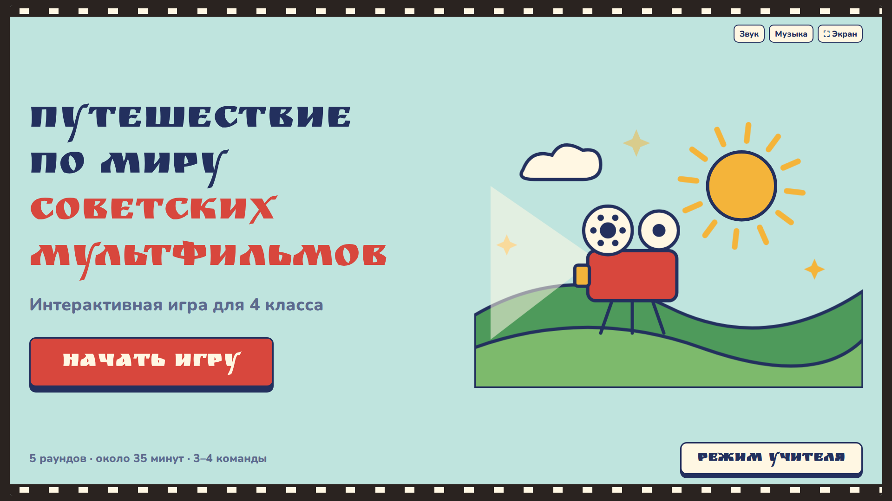 | 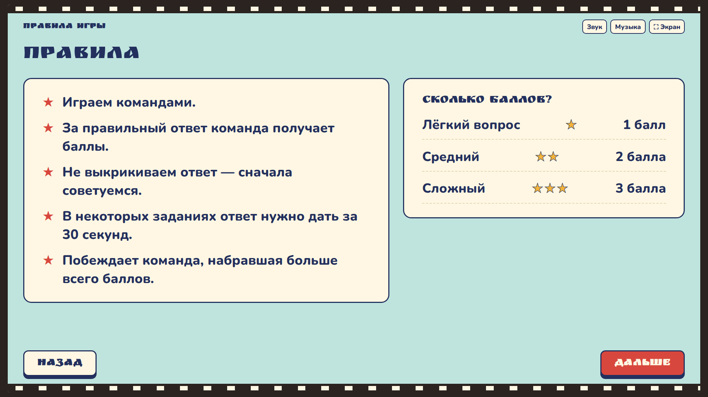 |
| **Команды.** 3 или 4 команды, названия можно придумать или сгенерировать кнопкой | **Меню раундов.** Пройденные раунды отмечены, внизу подсказка по времени урока |
| 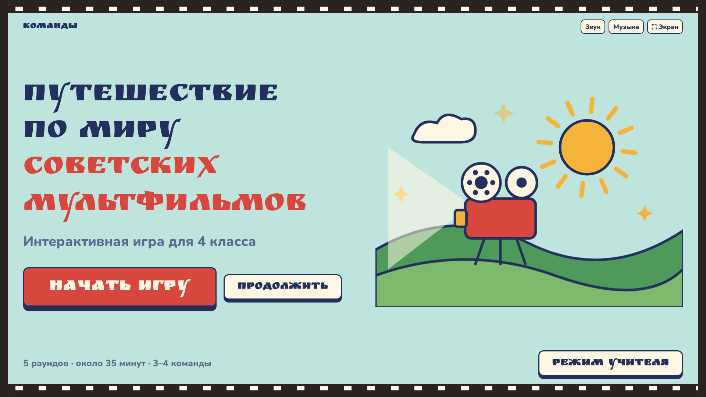 | 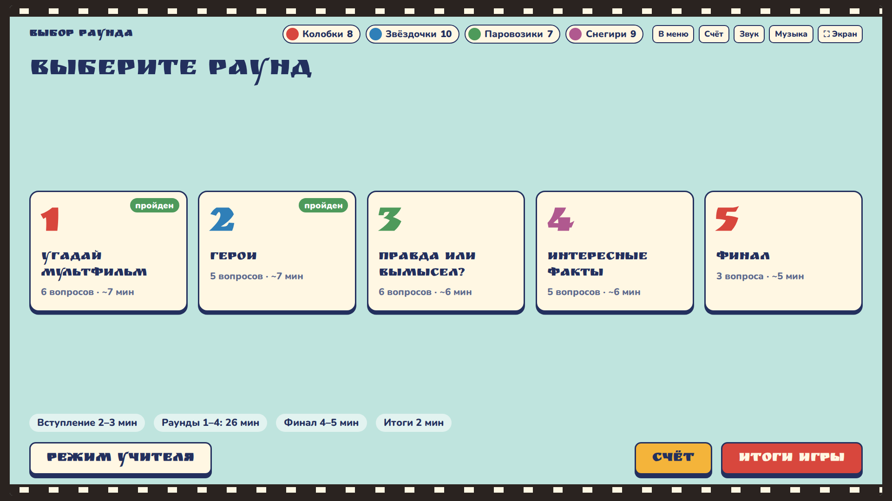 |

### Вопросы

| Вопрос с вариантами | Правильный ответ, факт и начисление баллов |
|---|---|
| 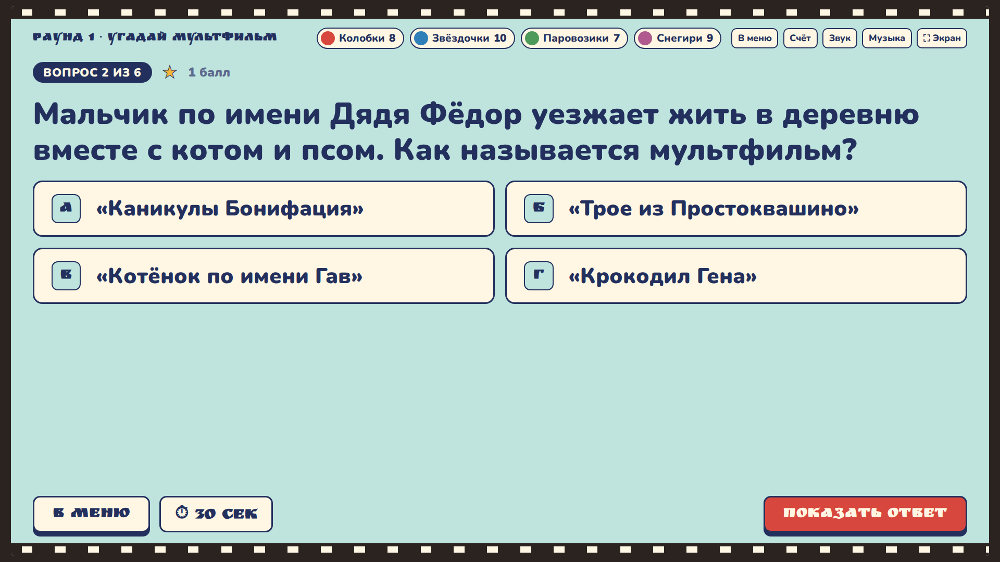 | 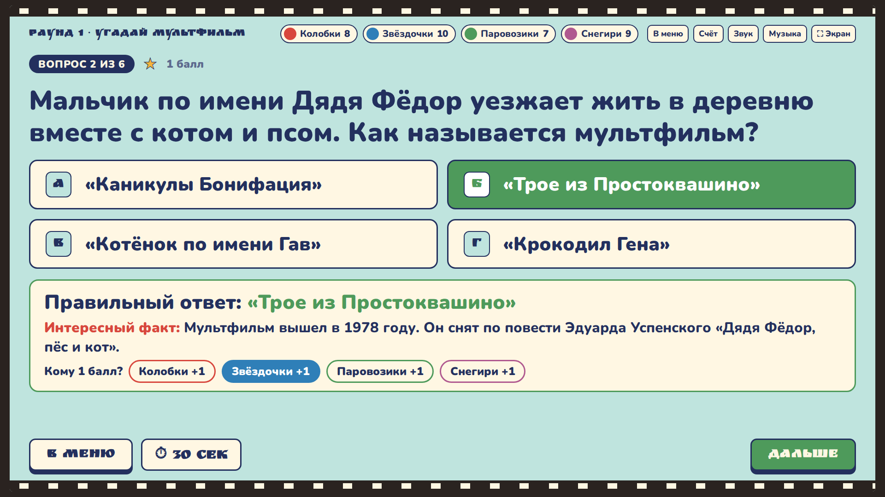 |
| **Неправильный ответ** подсвечивается красным, со звуком | **«Правда или вымысел?»** Две большие кнопки, их видно с последней парты |
| 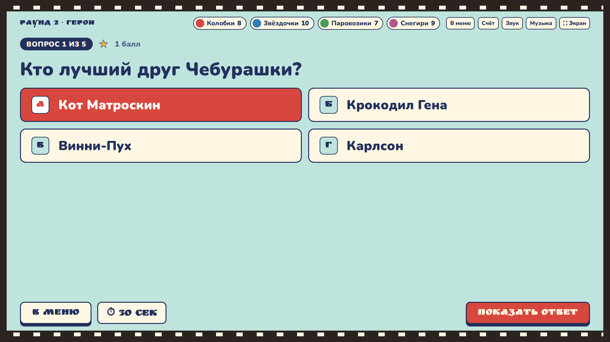 | 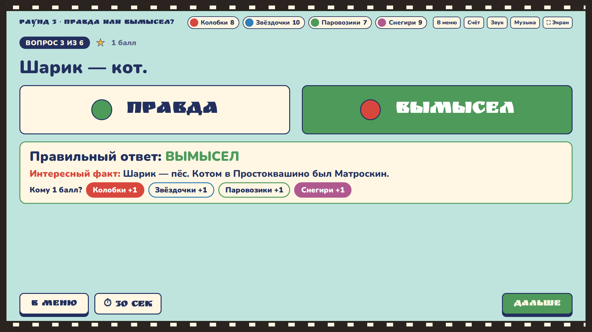 |
| **Литературный блок.** Метки «Кто автор?», «Что изменилось?» и другие | **Финал.** Подсказки открываются по одной, идёт таймер |
| 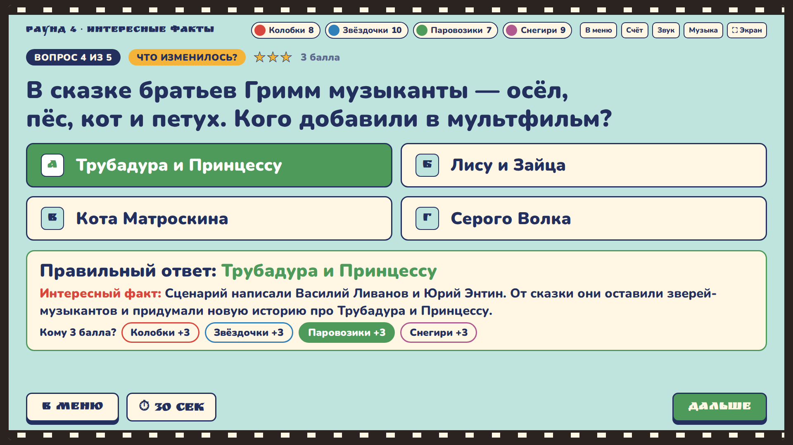 | 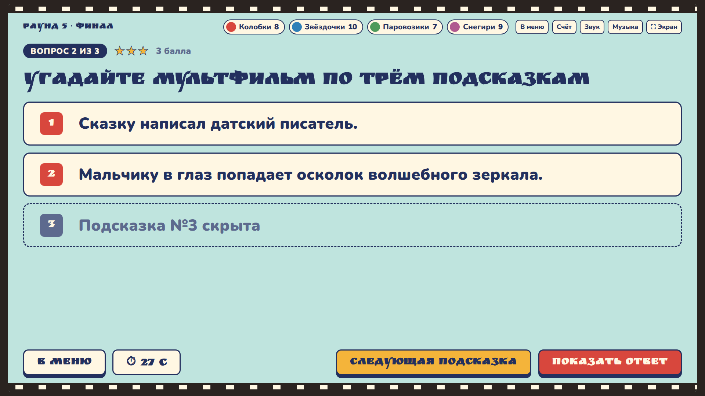 |

### Счёт и итоги

| Счёт после раунда | Итоги игры |
|---|---|
| 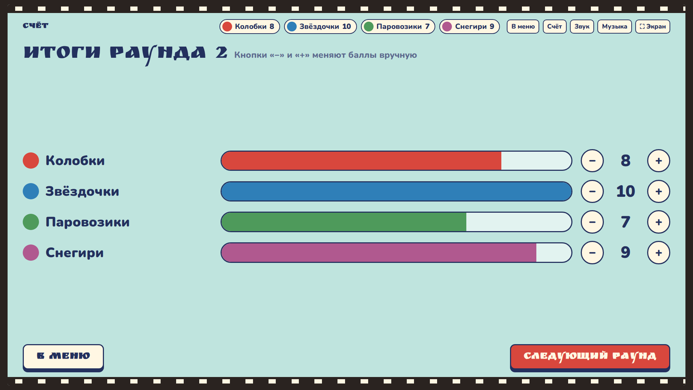 | 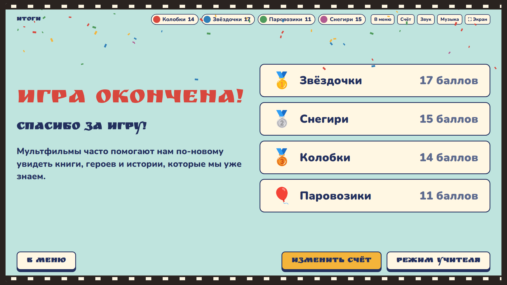 |

### Режим учителя

Панель открывается кнопкой «Режим учителя» или клавишей <kbd>У</kbd>. Дети видят игру, а учитель видит ответ заранее и управляет всем с одного экрана.

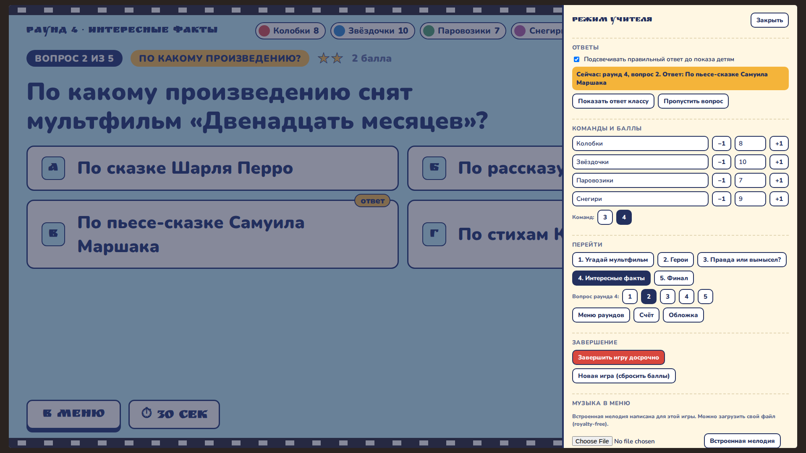

<details>
<summary><b>На телефоне</b> (для подготовки к уроку)</summary>
<br>
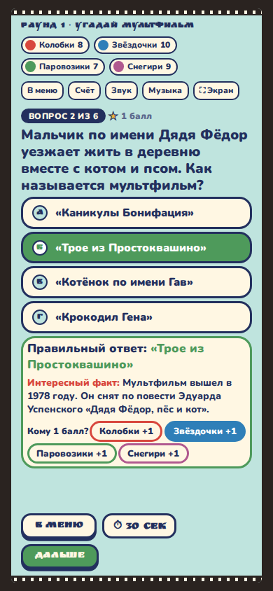
</details>

## Как запустить

**Проще всего:** открыть ссылку **[fegke12.github.io/multfilm-quiz](https://fegke12.github.io/multfilm-quiz/)** на компьютере, подключённом к проектору, и нажать «Экран», чтобы развернуть игру на весь экран.

**Без интернета:** скачать файл [`index.html`](index.html) (кнопка *Download raw file*) и открыть его двойным щелчком. Всё работает, только шрифты заменятся на системные.

Подробная инструкция для учителя с советами по проведению: [docs/TEACHER_GUIDE.md](docs/TEACHER_GUIDE.md).
Все вопросы с ответами для печати: [docs/QUESTIONS.md](docs/QUESTIONS.md).

## Авторские права

- Кадры, видео и персонажи мультфильмов в игру **не встроены**. Иллюстрация на обложке нарисована специально для проекта.
- Все звуки и мелодия меню генерируются кодом прямо в браузере, чужой музыки нет. При желании учитель может загрузить свой royalty-free трек.

---

## Для разработчиков

<details open>
<summary><b>Архитектура</b></summary>

Всё приложение — один файл `index.html` (~55 КБ) без сборки, фреймворков и зависимостей. Единственный внешний ресурс — два шрифта Google Fonts с системными запасными вариантами.

```
multfilm-quiz/
├── index.html              # игра целиком: разметка, стили, логика, данные
├── docs/
│   ├── QUESTIONS.md        # все вопросы с ответами (сгенерировано из данных игры)
│   ├── TEACHER_GUIDE.md    # инструкция для учителя
│   ├── demo.gif            # анимированное демо для README
│   └── screenshots/        # скриншоты экранов 1920×1080 и телефон 390×844
└── LICENSE
```

**Рендер.** Простая модель «состояние → HTML». Объект `S` хранит текущий экран, раунд, вопрос, счёт команд и начисленные баллы. Каждый экран — чистая функция (`cover`, `menu`, `question`, `scores`, `final`…), которая возвращает разметку для центральной области и нижней панели. После любого действия вызывается `render()`.

**События.** Один делегированный обработчик `click` на `document`. Каждая кнопка несёт `data-act` (`pick`, `reveal`, `award`, `next`…), а всё поведение описано в одном `switch` внутри функции `act()`. Декоративных кнопок нет: всё, что выглядит кнопкой, что-то делает.

**Сохранение.** Состояние пишется в `localStorage` после каждого рендера (с `try/catch` на случай приватного режима). Если браузер случайно закрыли, игра продолжится с того же вопроса и со счётом.

**Начисление баллов.** Идемпотентно: `S.awards["раунд-вопрос"]` хранит список команд, получивших баллы за вопрос. Повторное нажатие снимает баллы, так что двойное начисление невозможно.

**Звук.** Web Audio API: осцилляторы с огибающей громкости. Правильный ответ — мажорное арпеджио, неправильный — два низких square-тона, победа — фанфара. Фоновая мелодия — пентатоника, которую планирует `setInterval`. Никаких аудиофайлов и лицензий. `AudioContext` создаётся по первому клику, как требуют браузеры.

**Вёрстка под проектор.** Сцена держит пропорцию 16:9 и вписывается в окно. Размеры шрифтов заданы в `cqw` (container query units) с нижней границей в `px`, поэтому текст масштабируется вместе с экраном, а не с окном. На ширине < 760 px сетки перестраиваются в одну колонку.

**Доступность.** Видимый фокус для клавиатуры, `aria-pressed` у переключателей, `prefers-reduced-motion` отключает анимации и конфетти. Управление с клавиатуры: <kbd>→</kbd>/<kbd>Пробел</kbd> — следующий шаг, <kbd>У</kbd> — режим учителя, <kbd>Esc</kbd> — закрыть панель.

</details>

<details>
<summary><b>Как добавить или изменить вопросы</b></summary>

Все задания лежат в массиве `ROUNDS` в начале `<script>`. Три типа раундов:

```js
// вопрос с вариантами (type: "choice")
{ q: "Кто лучший друг Чебурашки?",
  o: ["Кот Матроскин", "Крокодил Гена", "Винни-Пух", "Карлсон"],
  a: 1,          // индекс правильного варианта
  p: 1,          // баллы: 1, 2 или 3
  t: "Кто автор?", // необязательная метка литературного блока
  f: "Интересный факт после ответа." }

// правда или вымысел (type: "tf")
{ q: "Шарик — кот.", a: false, p: 1, f: "Пояснение." }

// угадай по подсказкам (type: "clues")
{ c: ["Подсказка 1", "Подсказка 2", "Подсказка 3"], ans: "«Название»", p: 3, f: "Факт." }
```

Счётчики вопросов, меню и режим учителя подстраиваются под данные сами. После правки можно заново сгенерировать `docs/QUESTIONS.md`.

</details>

<details>
<summary><b>Технические решения</b></summary>

- **Почему без фреймворка.** Учитель должен открыть файл на любом школьном компьютере, в том числе без интернета и с устаревшим браузером. Один HTML-файл без сборки — самый надёжный вариант.
- **Почему `cqw`, а не `vw`.** Сцена 16:9 может быть меньше окна (на широком мониторе появятся поля), и шрифты должны зависеть от размера сцены, а не окна.
- **Почему звук синтезируется.** Нет файлов, которые могут не загрузиться, и нет вопросов о лицензиях.
- **Почему победитель не выбирается автоматически при нуле баллов.** Если баллы не выставлялись, экран итогов показывает пустые места «Команда — ______», а не объявляет случайного победителя.
- **Ничьи.** Команды с одинаковым счётом получают одинаковое место и одинаковую медаль.

</details>

## Автор

**Виталий Реннер** · [@Fegke12](https://github.com/Fegke12)

Лицензия [MIT](LICENSE).
